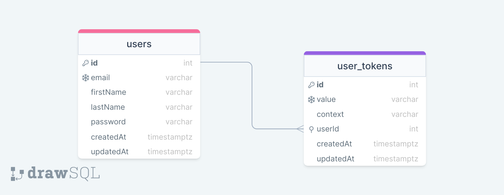

# Authenticate Me

Demonstration of the authentication flow in a full stack application.

## Getting started

Clone the repository

```
$ git clone https://github.com/ntson/authenticate-me.git
$ cd authenticate-me
```

Install dependencies

```
$ cd api && npm install
$ cd ../web && npm install
```

Remember to create a `.env` file in the `api` folder

```
NODE_ENV=development
```

Also a `.env.local` file in the `web` folder

```
NEXT_PUBLIC_BACKEND_URL=http://localhost:4000
```

Migrate the database

```
$ npm run db:migrate:local # in the api folder
```

Start the development server

```
$ npm run dev # in both api and web folder
```

## Database schema



## Auth flow

- The user submits the register or login form on the web page.
- The frontend sends POST request to the respective Next.js API route (`/api/login` or `/api/register`) with the data.
- The Next.js API route sends POST request to the respective server-side route (`[BACKEND_URL]/api/register` or `[BACKEND_URL]/api/login`).
- The server creates new user or check the user credentials.
- The server creates a new record in the `user_tokens` database with a randomly generated unique value and a context of "access".
- The server sends back the token.
- The Next.js API routes save the token in a http-only cookie.
- Whenever the frontend requests a protected resource on the server, first send a GET request to `/api/access-token` Next.js API route, and include the token in the authorization header.
- The server then checks if the token is valid (the token has to both be present and belong to a user).
- When logging out, Next.js API route first delete the cookie, then send a DELETE request to `[BACKEND_URL]/api/logout`, the server then simply deletes the token in the database.
- In case the user chooses log out from all devices, the server deletes all tokens that belong to that user in the database.
